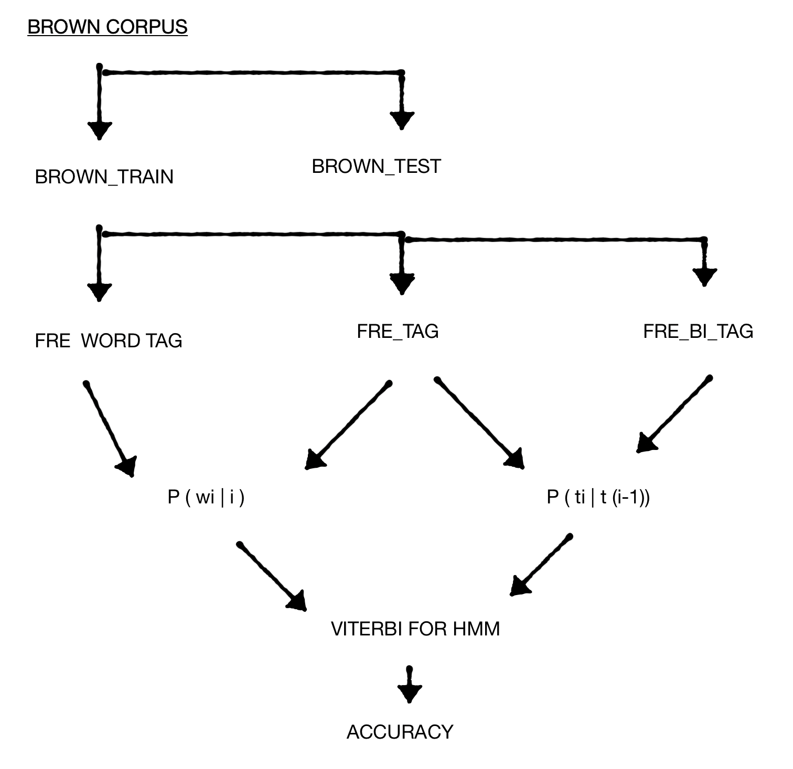

## HMM-based POS tagger on the English corpus

## OBJECTIVE
To write a program in Python to implement an HMM-based POS tagger on the English
language.

DATASETS USED
Brown corpus,  contains word and there POS tags

## Mathematical model
HMM is a special case of Bayesian inference. 
Modeling: P (Y|X)
	
Probability of symbol emissions , that is the likelihood of specific label ti, provided a specific word Wi , P(Wk| ti). 
 Probability of transition between states, i.e. the likelihood of a specific label relying upon the past labels, , P(ti | ti-1 ti-2….. ti-k ).  P( tk)

  	 T = argmax  P(wi| ti) P( tk)

# Training: 
	 
	P(ti | ti-1) = C( ti-1)(ti)/C(ti-1) .

	P(wi | ti) = C(ti, wi)/ C(ti)

# Viterbi Algorithm:
	
	Vi(j) = max Vt-1(i) • aij • bj(ot)

Vt-1(i)  = previous Viterbi path probability
aij         = transition probability
bj(ot)    = state observation likelihood

Total number of tag sequence in HMM tagger are,  (T)^(W)
Where, T = tags
	 W = words 

# Assumptions:
1. The probability of word only depend on its POS tag and independent on other words and tags.
2. Probability of tag only depends on its previous tag.

## PROCEDURE

Corpus  : Brown corpus
 
### 1.Divide corpus into two sections one for training and one for testing which contain first 10 sentences.

	# insert start "<s>" and end "<\s>" symbols for each sentence 
	p = brown.tagged_sents()
	brown_corpus = []
	for i in p :
    	i.insert(0,('<s>','<s>'))
    	i.insert(len(i),('<\s>','<\s>'))
   		 brown_corpus.append(i)
    
	# creating test and training sets from brown corpus
	#test set containt first 100 sentences for testing porpuse
	brown_test = []
	brown_train = []
	sen = 0
	for i in brown_corpus:
	    sen += 1
	    if sen <= 10:
		brown_test.append(i)
	    else:
		brown_train.append(i)

### 2 Obtaining  patterns from training set 
1. fre_wordtag - frequency of word for given tag
2. fre_tag - frequency of tags in training set
3. fre_bi_tag - frequency of tag given it’s previous tag

# frequency function 

	def fre(x):
	    from collections import Counter
	    types =  Counter(tuple(x) for x in x )
	    #print(types)  # types is in the form of directories

	    # converting dictionary into two dimentional array 
	    freq = []
	    for value in types.items() :
		freq.append(value)

	    #sorting array  in decending order
	    def sortthird(freq): 
		return freq[1] 
	    freq.sort(key = sortthird ,reverse = True) 
	    #print(freq)
	    return freq

	#considering training set as only [word , tag] insted of sentence 
	brown_words_tag = []
	for i in brown_train:
	    for j in i:
		brown_words_tag.append(j)
        
# frequency of brown_words_tag

	fre_wordtag = fre(brown_words_tag)
	#print(fre_wordtag)

	#frerquency of ti (tag) 
	brown_tag = []
	for i in brown_train:
	    for j in i:
		 brown_tag.append(j[1])

# getting frequency of brown_tag

	types =  collections.Counter(brown_tag)
	#print(types)  # types is in the form of directories

	#converting dictionary into two dimentional array "a"

	fre_tag = []
	for value in types.items() :
	    fre_tag.append(value)

	#sorting array in decending order
	def sortthird(fre_tag): 
	    return fre_tag[1] 
	fre_tag.sort(key = sortthird ,reverse = True) 
	#print(fre_tag)

### 3. Getting probabilities from frequency counts

	Probability of tag given its previous tag
	P(ti | ti-1) = C( ti-1)(ti)/C(ti-1) .

Probability of word given its tag 
2.   P(wi | ti) = C(ti, wi)/ C(ti)

# probabitity of p(wi|ti)

	probWiti = []
	list1 =[]
	list2 = []
	list3 = []
	for i in fre_wordtag:
	    for j in fre_tag:
		if i[0][1] == j[0]:
		    temp = [i[0] , i[1]/j[1]]
		    probWiti.append(temp)
		    list1.append(i[0][0])
		    temp1 = [i[0][1], i[1]/j[1]]
		    list2.append(temp1)

	#probWiti

	#probability of p{ti|t(i-1)}

	#frequency of bigram taggs
	bi_tag = []
	x = len(brown_words_tag)
	for j in range(x):
	    if j+1 < x:  
		temp = [brown_words_tag[j][1] , brown_words_tag[j+1][1]]
		if temp != ['<\s>' ,'<s>' ]: # not cosidering ['<\s>' ,'<s>'] count b/z it's a end of sentance 
		    bi_tag.append(temp)

# frequency of 

	fre_bi_tag= fre(bi_tag)
	#print(fre_bi_tag)

# probabitity of p(wi|ti)

	probbitag = []
	for i in fre_bi_tag:
	    for j in fre_tag:
		if i[0][0] == j[0]:
		    temp = [i[0] , i[1]/j[1]]
		    probbitag.append(temp)

	#probbitag

## 3. Set of all posible tags present in training corpus

set of all differet tags present in brown corpus
#since the probability of word depending on tag and probability of tag depeds on its previous tag there should not be any unk tag present in HMM tagger
		
		pos_tag = [] 
		for i in fre_tag:
		    pos_tag.append(i[0])

### 4. Viterbi Algorithm
After gettin all probability needed for Viterbi now it’s time for fun.

# vitervi algorithm

creating lattice of transition and emissions probability
	
	for j in probWiti:
	    j[0][0]
	#emission probability for this sentance
	l = len(sentance)
	c = 1
	sentance = brown_test[4]    # change the sentance by replacing sentance number in brown_test out of first 10 sentances
	lattic_emission = [[] for i in range(l)]  #emission probability lattic
	sen_tag = []                              #set of all different tags sentance can have 
	for i in range(l):
	    for j in probWiti:
		if sentance[i][0] == j[0][0]: 
		    lattic_emission[i].append(j) #lattice will only have element whose emission probability > 0, b/z for 0 emission probability final probability become zero
		    if j[0][1] not in sen_tag:
			sen_tag.append(j[0][1]) #set of all posible taggs s sentance can have
	    if(len(lattic_emission[i])== 0):    #for unknown words in sentance 
		temp = [(sentance[i][0], 'NN') , 0.11 ] # unk are consider as 'NN' with probability of 0.11 b/w 11% accuracy is for unknoen wors as ' 
		lattic_emission[i].append(temp)

            
	#transition tags for this sentance
	l = len(sen_tag) 
	tran_tag = []
	for i in sen_tag:
	    for j in sen_tag:
		temp = (i , j)
		if temp not in tran_tag: # avoid repetitions 
		    tran_tag.append(temp)

	#transition probability for this sentance
	tran_pro = []
	for i in tran_tag:
	    for j in probbitag:
		if i == j[0]:  
		    tran_pro.append(j) # the tag pairs not in probbitag have zero probability again we are not considering them since result for such sentace will have 0 probability
	mat = []
	for i in lattic_emission:
	    temp = [i[0][0][0], len(i)]
	    mat.append(temp)       # number of possible tags outcomes for given word in a given sentance 

	max_emission = []
	sequence = []
	for i in lattic_emission:
	    def sortthird(i): 
		return i[1] 
	    i.sort(key = sortthird ,reverse = True) # getting maximum emission probability after each step
	    max_emission.append(i)
	l = len(mat)
	vi = []
	for i in range(l-1):
	    if i < l:
		temp =(max_emission[i][0][0][1],max_emission[i+1][0][0][1])
		vi.append(temp)
		sequence.append(max_emission[i][0][0])
	temp = ('<\s>', '<\s>')
	sequence.append(temp)
	l = len(vi)
	Vj = [] #argmax from probability multiplication of transition and emission probabilities 
	m = 0
	for i in range(l):
	    for j in tran_pro:
		m += 1
		if vi[i] == j[0]:
		    temp = max_emission[i][0][1]*j[1]
		    Vj.append(temp)
		    temp1= [max_emission[i][0][0],j[0]]
	    temp1= [max_emission[i][0][0],j[0]]
	    if(temp1 not in sequence):
		temp1= [max_emission[i][0][0],j[0]]

	def viterbi(Vj) : 
	    result = 1
	    for x in Vj: 
		 result = result * x  
	    return result         
	Viterbi = viterbi(Vj)
	print(sequence , '\n' ,Viterbi)

# 5.accuracy of Viterbi Algorithm

	# the accuracy 
	l = len(sentance)
	count = 0
	for i in range(l):
	    if sentance[i] == sequence[i]:
		count +=1
	accuracy = (count / len(sentance))*100
	print("accuracy of HMM tagger for given sentance is ")
	print(accuracy)     # we are getting accuracy less because of prase types, different prase futher have different pos tags which are algorithm does not consider some time 

### Results: (only for one sentence, in this case sentence # 4 from testing set)    

	[('<s>', '<s>'), ('The', 'AT-TL'), ('jury', 'NN-HL'), ('said', 'VBD'), ('it', 'PPS-HL'), ('did', 'DOD-NC'), ('find', 'VB'), ('that', 'WPS-NC'), ('many', 'AP-NC'), ('of', 'IN-TL'), ("Georgia's", 'NP$'), ('registration', 'NN'), ('and', 'CC-HL'), ('election', 'NN'), ('laws', 'NNS'), ('``', '``'), ('are', 'BER-HL'), ('outmoded', 'JJ'), ('or', 'CC-NC'), ('inadequate', 'JJ'), ('and', 'CC-HL'), ('often', 'RB'), ('ambiguous', 'JJ'), ("''", "''"), ('.', '.-HL'), ('<\\s>', '<\\s>')] 
	5.0121351597188597e-33
	accuracy of HMM tagger for given sentence is 
	53.84615384615385

After implementation of Viterbi Algorithm we get most accurate sequence of tags with probability of sentence as 5.0121351597188597e-33 But if we compare it with our original tagged sentence we found that accuracy of sentence is only 53.84615384615385% 
Which is much less compare to bigram and unigram tagger but here actor probability is more since HMM does good job in identifying phrases.  Also brown corpus is case sensitive it same word can have different tags, depending on words first alphabet is capital. 

## Unknown words :

For  algorithm also works for unknown words, for unk words which are Not in training set algorithm consider them as ‘NN’. Since maximum words in training set tagged as noun, also tagging ‘unk’ as ‘NN’
Gives 11 % accuracy as we seen in previous assignments. Also for we have consider word given noun have 0.11 probability for probability multiplications.

## Comparison:

The computation of HMM is very expensive as all possible tag sequences are required to be checked in order to find the sequence that maximizes the probability. For n number of tags and w number of word HMM will have  (n^m) different tag sequences. So a dynamic programming approach known as the Viterbi Algorithm is used to find the optimal tag sequence.
As all other stochastic taggers, the task of HMM based taggers are very simple, to find the most likely tag for a word or a sequence of words. Unlike other taggers, HMM usually tags one sentence at a time. Given the sentence, it chooses the tag sequence that maximizes the formula: 
	
	P (word | tag) * P (tag | previous n tags) 

whereas the other tagging methods greedily tag one word at a time, without regard to the optimal combination. HMM tagger does best job compare to some of other taggers but it’s not her most accurate tagger, interpolation tagger can do better than HMM. 
 
## HMM and Ambiguity:

HMM tagger can identify ambiguous sentence since it consider hole sentence while tagging, which is importance for finding ambiguity, HMM tagger gives different probabilities for ambiguous sentence, depending on probability the most accurate sentence can consider to have greater probability Than it’s other ambiguous tag sequences.

## Further:

Further we can take implement HMM tagger with tags depending on it’s three or more previous tags. Or with deep learning models. 
